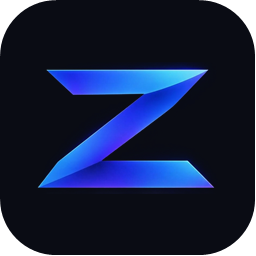
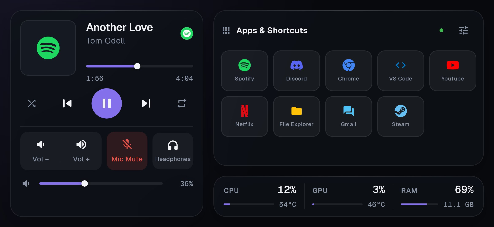
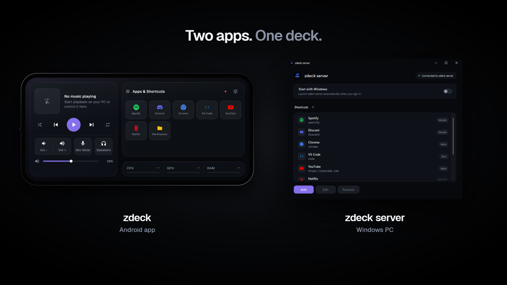
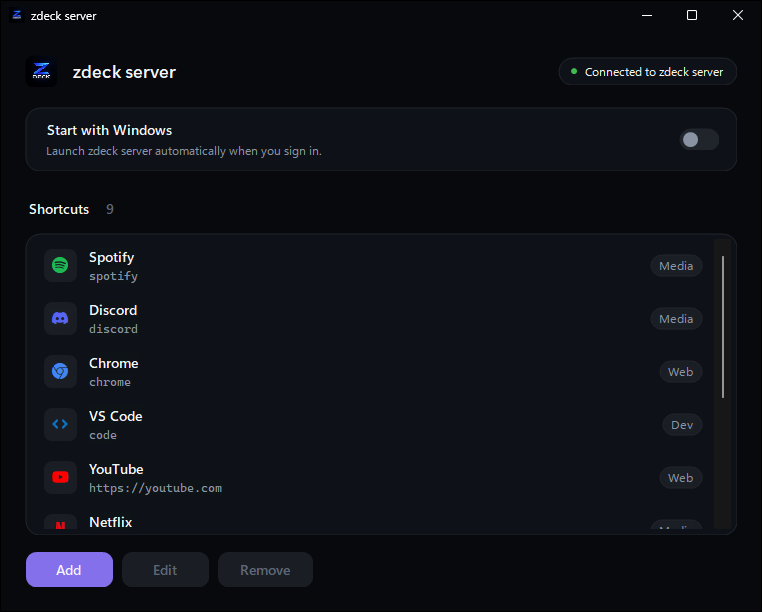
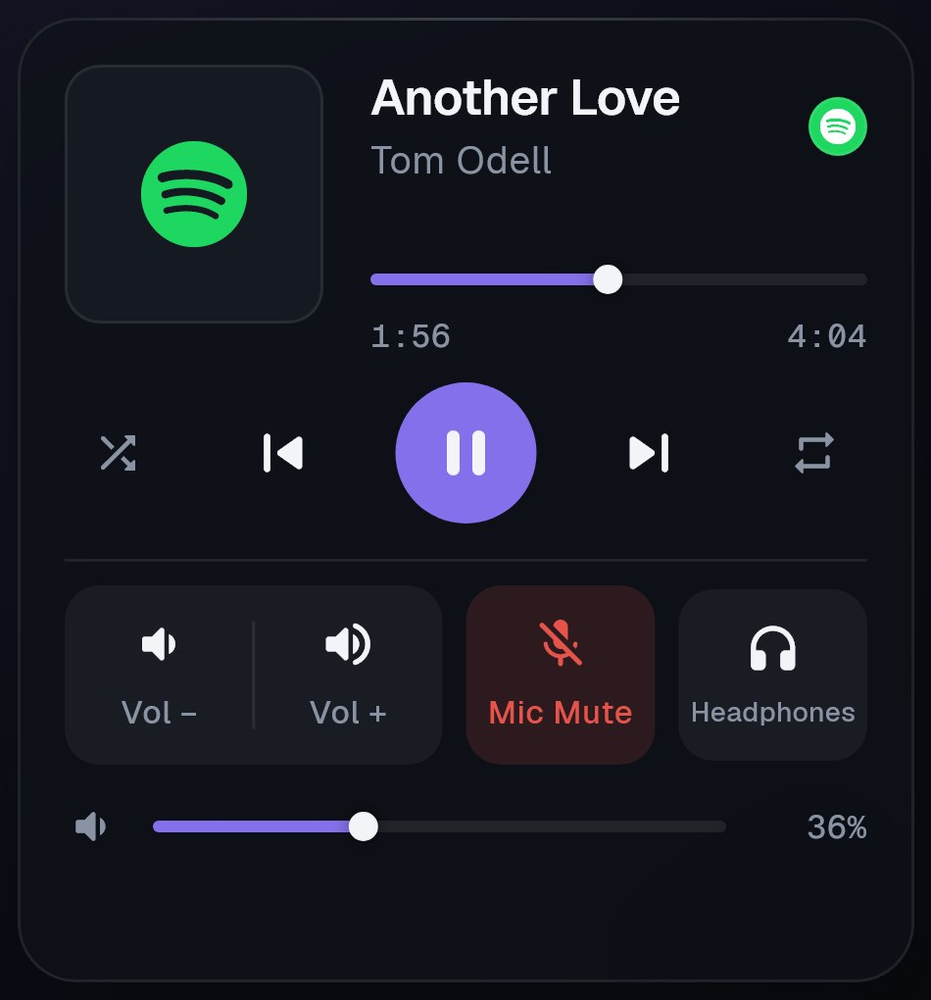
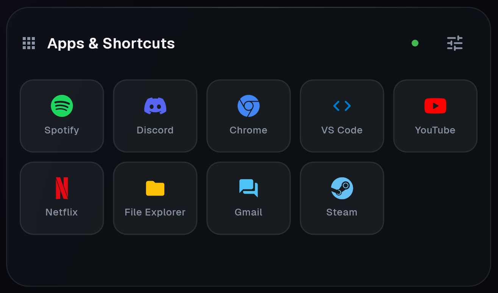
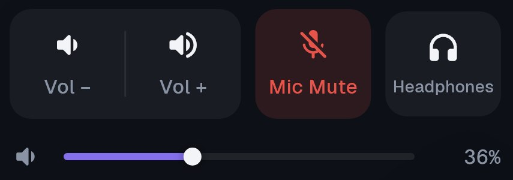
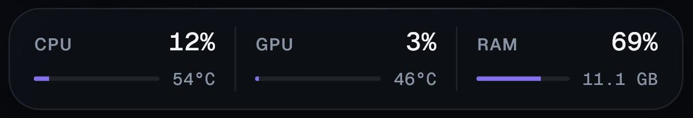

  

<h1 align="center">zdeck</h1>

  <b>Your PC. In your hand.</b> 
  Turn your Android phone into a Stream Deck style control panel for your Windows PC.

  <a href="https://zdeck-iota.vercel.app/"><b>🌐 Website</b></a> &nbsp;•&nbsp;
  <a href="releases/zdeck-android-v1.0.0.apk"><b>📱 Download for Android</b></a> &nbsp;•&nbsp;
  <a href="releases/zdeck-server-setup-v1.0.0.exe"><b>💻 Download for Windows</b></a>

---

zdeck is two apps that work together. **zdeck for Android** is the deck: one calm, landscape dashboard with your music, volume, microphone, app shortcuts and live PC performance. **zdeck server** is a small Windows app that lives in your system tray and carries out every tap. They find each other over Wi-Fi by themselves, with no IP address to type.

🌐 **Website:** [https://zdeck-iota.vercel.app/](https://zdeck-iota.vercel.app/)

---

## 🖼️ Preview

### Dashboard

> The whole deck on one landscape screen: now playing, sound controls and mic mute on the left; app shortcuts and live CPU / GPU / RAM on the right.

### Video Preview

> A 30 second launch film: the phone and the PC finding each other, music and volume, mic mute, launching an app, live stats, a shortcut syncing from the PC to the phone, and Start with Windows.

[Direct link to the video](docs/media/combined.mp4) &nbsp;•&nbsp; [Watch it on the website](https://zdeck-iota.vercel.app/#film)

### zdeck server (Windows)

> The tray app's window: connection status, Start with Windows, and your shortcut list.

### Up close

| Music | Apps & Shortcuts |
|---|---|
|  |  |

| Sound & Mic | Performance |
|---|---|
|  |  |

---

## 📥 Downloads

| App | File | Size | Runs on |
|---|---|---|---|
| 📱 **zdeck for Android** | [`zdeck-android-v1.0.0.apk`](releases/zdeck-android-v1.0.0.apk) | 53.4 MB | Android 7.0 or newer |
| 💻 **zdeck server** | [`zdeck-server-setup-v1.0.0.exe`](releases/zdeck-server-setup-v1.0.0.exe) | 12.5 MB | Windows 10 (2004+) / 11, 64-bit |

SHA-256 checksums are in [`releases/SHA256SUMS.txt`](releases/SHA256SUMS.txt).

---

## 📦 Requirements

- A **Windows 10 (version 2004 or newer) or Windows 11** PC, 64-bit
- An **Android phone** running Android 7.0 or newer (designed for a 6.7" screen in landscape)
- Both on the **same Wi-Fi / home network**
- **.NET 10 Desktop Runtime** on the PC. You don't need to get it yourself: the installer downloads and installs it from Microsoft if it's missing.
- An administrator account on the PC to run the installer (not needed to use zdeck)

---

## 📁 Installation

### 1. On your PC: zdeck server

1. Download [`zdeck-server-setup-v1.0.0.exe`](releases/zdeck-server-setup-v1.0.0.exe) and run it.
2. If SmartScreen shows **"Windows protected your PC"**, click **More info** → **Run anyway** (the installer isn't code-signed yet).
3. Click **Yes** on the permission prompt and follow the wizard. On **Additional tasks** you can pick:
   - **Create a desktop shortcut**
   - **Start zdeck server when I sign in to Windows** (recommended)
4. Leave **Launch zdeck server** ticked and click **Finish**.

The installer puts zdeck server in `C:\Program Files\zdeck`, adds it to the Start menu, allows it through Windows Defender Firewall on private networks, and registers an uninstaller under **Settings → Apps**. A zdeck icon appears in your tray, near the clock.

### 2. On your phone: zdeck for Android

1. Download [`zdeck-android-v1.0.0.apk`](releases/zdeck-android-v1.0.0.apk) on your phone (or copy it over by USB, Drive, email...).
2. Open it. If Android says it can't install apps from this source, tap **Settings**, turn on **Allow from this source**, then go back and tap **Install**.
3. If Google Play Protect warns about an unknown app, tap **More details** → **Install anyway** (zdeck isn't on the Play Store yet).
4. Open **zdeck**.

### 3. Connect

Make sure the phone and the PC are on the same Wi-Fi. Open zdeck on the phone: it finds the PC on its own. The status dot next to **Apps & Shortcuts** turns green and the live stats start moving. That's it.

---

## 🚀 Usage

Hold the phone sideways. zdeck always runs full screen in landscape.

**Left side: music and sound**

- See what your PC is playing: artwork, title, artist and progress.
- **Previous / Play-Pause / Next**, **Shuffle** and **Repeat**.
- Drag the progress bar to **seek**.
- **Vol − / Vol +** for small steps, or drag the **volume slider** for an exact level.
- **Mic Mute** turns red while your PC microphone is muted.
- The **output button** (headphones icon) shows the current audio device; tap it to switch between speakers, headphones and any other output.

**Right side: apps and performance**

- **Tap** a shortcut tile to open that app or site on your PC. If it's already running, zdeck brings it to the front instead of opening a second copy.
- **Long-press** a tile to always open a **new instance**.
- Tap the **settings button** (top right of the apps panel) to add, edit, delete and reorder shortcuts, and to set up standby.
- The bottom strip shows **CPU, GPU and RAM** live.

**On the PC**

- Closing the zdeck server window hides it to the tray; the server keeps running.
- Double-click the tray icon (or right-click → **Open**) to bring it back.
- Right-click the tray icon → **Exit** to stop zdeck server completely.

---

## 🔍 Features

### 🎵 Music control
- **Works with any player**: controls whatever Windows reports as "now playing", including Spotify, YouTube and Netflix in a browser, Chrome, Edge, Firefox and Windows Media Player.
- **Now playing card** with album artwork, title, artist and a live progress bar with elapsed / total time.
- **Full transport**: previous, play/pause, next, shuffle and repeat (shuffle and repeat when the playing app supports them).
- **Seekable progress bar**: drag to jump anywhere in the track.
- **Source badge**: the real logo of the app that's playing (Spotify, YouTube, Netflix, Chrome, Firefox, Edge...). It also stands in for the artwork when the track has none.

### 🔊 Sound control
- **Master volume slider** (0 to 100%) plus **Vol − / Vol +** step buttons.
- **Audio output switching**: pick any of your PC's output devices (speakers, headphones, monitor audio...) from a list on the phone. This uses a Windows API that a few Windows builds don't expose.
- Numbers use a monospaced font, so values don't jitter while they change.

### 🎙️ Microphone mute
- **One-tap mic mute / unmute** for your PC's default communications microphone (the one Discord, Teams, Zoom and games use for voice).
- The button turns **red** while muted, so you always know whether you're live.

### 🚀 App shortcuts
- **Launch apps, folders and websites** on your PC from a tile grid: anything with an `.exe` path, a command the shell understands (`spotify`, `code`...), or a URL.
- **Smart launch**: tap brings a running app to the front; long-press forces a fresh instance.
- **Full editor on the phone**: add, edit and delete shortcuts, and **drag to reorder** them.
- **30 built-in icons**, including real brand logos (Spotify, Discord, Chrome, Steam, YouTube, Netflix, Notion, OBS...) and colored glyphs for code, games, terminals, folders, notes, video and more.
- **Optional categories** (Media, Web, Dev, System...) to keep things organised.
- **Scrollable grid** that fits as many shortcuts as you like.
- **Two-way sync**: add a shortcut in the Windows app and it appears on the phone instantly, and the other way round. Shortcuts are saved on the PC (`%APPDATA%\zdeck\shortcuts.json`), so they survive reinstalls of the phone app.
- Comes with a starter set: Spotify, Discord, Chrome, VS Code, YouTube, Netflix and File Explorer.

### 📊 Live PC performance
- **CPU usage** and **CPU temperature**
- **GPU usage** and **GPU temperature**
- **RAM usage** as a percentage and in GB used
- All updated live from the PC, with slim meters for each.
- CPU temperature needs zdeck server to run as administrator (a Windows restriction). Everything else works without it.

### 📡 Connection
- **Automatic discovery**: the phone finds the PC with a LAN broadcast. No IP address to type, even when your PC's address changes.
- **Auto-reconnect**: if Wi-Fi drops, the PC sleeps or the server restarts, the phone retries in the background and rediscovers the PC by itself.
- **Status indicator**: green dot when connected, red when the PC is offline.
- Runs entirely on your local network. No account, no cloud, nothing leaves your home network.

### 🕰️ Standby mode
- After a period without touches, the dashboard switches to a **full-screen standby clock** (inspired by iPhone StandBy), so a phone sitting on your desk isn't a bright control panel all day.
- Tap anywhere to wake it; the dashboard comes back exactly as it was.
- **Configurable**: turn it on or off and choose 10 s, 30 s, 1 min, 2 min or 5 min. The setting is remembered.

### 📱 Phone experience
- **Landscape, full screen** (immersive mode): no status or navigation bars in the way. Swipe from the edge to show them briefly.
- **Haptic feedback** on every committed action.
- **Tactile controls** that respond when pressed, with animations kept to feedback only. Respects the system's reduced-motion setting.
- **Dark, minimal design** with subtle glass panels, built for a 6.7" phone and adapting to other screen sizes.

### 💻 zdeck server (Windows)
- **Real installer**: Program Files install, Start menu and desktop shortcuts, and an uninstaller in Settings → Apps.
- **Lives in the system tray**: closing the window hides it; the tray menu has **Open** and **Exit**.
- **Start with Windows** switch (per user, no admin rights needed).
- **Shortcut manager** with Add / Edit / Remove, a **Browse...** button to pick any `.exe`, and the **same icon picker** as the phone.
- **Live connection status** in the window.
- **Self-healing**: if the server stops unexpectedly, the tray app restarts it. When you exit, everything shuts down cleanly with nothing left running.
- **Firewall configured for you** on private networks during install.
- **Automatic .NET runtime setup**: the installer fetches the .NET 10 Desktop Runtime if it's missing.

---

## ⚙️ Configuration

| Setting | Where | What it does |
|---|---|---|
| **Shortcuts** | Phone: settings button on the apps panel · PC: zdeck server window | Add, edit, delete and reorder tiles. Synced both ways. |
| **Standby** | Phone: settings button → Standby | Turn the standby clock on/off and pick the idle timeout. |
| **Start with Windows** | PC: zdeck server window (or during install) | Starts zdeck server in the tray when you sign in. |
| **CPU temperature** | PC: right-click **zdeck server** in the Start menu → **Run as administrator** | Lets Windows share the CPU temperature. |
| **Network ports** | Fixed | TCP **8777** (control connection) and UDP **8778** (discovery) on your local network. |

---

## 🛠️ Troubleshooting

**The phone says the PC is offline**
- Check that the zdeck server window shows the green status.
- Phone and PC must be on the same network. Mobile data, guest Wi-Fi and routers with **AP / client isolation** stop devices from seeing each other.
- In Windows, set your Wi-Fi / Ethernet network profile to **Private** (the firewall rule applies to private networks).
- Turn off VPNs on the phone and the PC, or allow ports 8777 / 8778 in a third-party firewall.

**zdeck server doesn't open**
- The .NET 10 Desktop Runtime may be missing. Install **Windows x64** under ".NET Desktop Runtime 10" from [dotnet.microsoft.com](https://dotnet.microsoft.com/download/dotnet/10.0).

**Music controls don't respond**
- zdeck controls whatever Windows shows as "now playing". Start playback in your player once, then use the phone.

**"App not installed" when updating the APK**
- Uninstall the old zdeck from the phone first, then install the new APK.

---

## 🧹 Uninstall

- **PC:** Settings → Apps → Installed apps → **zdeck server** → Uninstall. This also removes it from startup and the firewall. Your shortcuts in `%APPDATA%\zdeck` are kept; delete that folder to remove them too.
- **Phone:** long-press the zdeck icon → App info → Uninstall.

---

## 🧩 Use Cases

- A **desk companion** for gaming, streaming or working, with media and mic always one tap away without alt-tabbing
- **Muting your mic** instantly during calls, streams and meetings
- **Launching your daily apps** (editor, browser, Discord, Steam, OBS) from a dedicated panel
- **Watching temperatures and load** while gaming, rendering or compiling
- Giving an **old Android phone** a second life as a Stream Deck alternative, for free

---

## 🏗️ Built With

- **Flutter / Dart**: the Android app
- **Dart**: zdeck server (WebSocket + LAN discovery)
- **.NET 10 (C#)**: the Windows tray app and native helpers for audio, media, performance counters and app launching
- **LibreHardwareMonitorLib**: GPU usage and temperatures
- **Geist / Geist Mono** typefaces, **Simple Icons** brand logos

---

## 👤 Author

Developed by **Zayed**. If zdeck helps you, consider ⭐ starring the repository!

---

## 📄 License

zdeck is provided for public use. Reselling or claiming ownership is not permitted.
